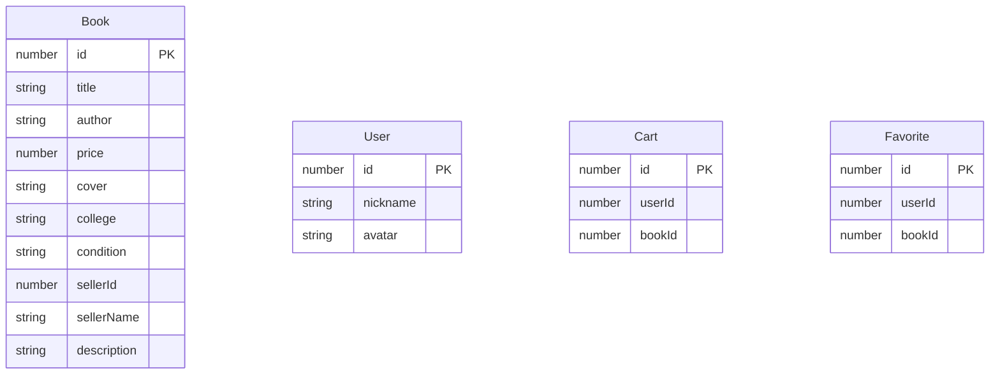

## 1. 架构设计

```mermaid
graph TD
    "UI 层 (Vue Components)" --> "状态管理层 (Pinia Stores)"
    "状态管理层 (Pinia Stores)" --> "Mock 数据层"
    "路由层 (Vue Router)" --> "UI 层 (Vue Components)"
```

## 2. 技术说明
- 前端：Vue@3 + TypeScript + Vite
- 状态管理：Pinia
- 路由：Vue Router@4
- 样式：Tailwind CSS@3
- 图标：Lucide Vue
- 数据：本地 Mock 数据，模拟用户 ID 10086

## 3. 路由定义
| 路由 | 用途 |
|------|------|
| / | 首页：瀑布流书籍展示 + 筛选 |
| /book/:id | 详情页：单本书籍详情 |
| /profile | 个人中心：我发布和收藏的书 |

## 4. 数据模型

### 4.1 数据模型定义



### 4.2 TypeScript 类型定义

```typescript
interface Book {
  id: number
  title: string
  author: string
  price: number
  cover: string
  college: string
  condition: '全新' | '九成新' | '八成新' | '七成新' | '六成新及以下'
  sellerId: number
  sellerName: string
  description: string
}

interface User {
  id: number
  nickname: string
  avatar: string
}

interface CartItem {
  bookId: number
  quantity: number
}

interface Filters {
  colleges: string[]
  priceRange: [number, number]
}
```

## 5. 目录结构

```
src/
├── components/
│   ├── BookCard.vue          # 可复用书籍卡片
│   ├── NavBar.vue            # 导航栏
│   ├── FilterSidebar.vue     # 左侧筛选栏
│   └── LoginModal.vue        # 登录提示弹窗
├── stores/
│   ├── book.ts               # 书籍数据 store
│   ├── cart.ts               # 购物车 store
│   ├── user.ts               # 用户 store
│   └── favorite.ts           # 收藏 store
├── pages/
│   ├── HomePage.vue          # 首页
│   ├── DetailPage.vue        # 详情页
│   └── ProfilePage.vue       # 个人中心
├── mock/
│   └── data.ts               # Mock 数据
├── router/
│   └── index.ts              # 路由配置
├── App.vue
└── main.ts
```
