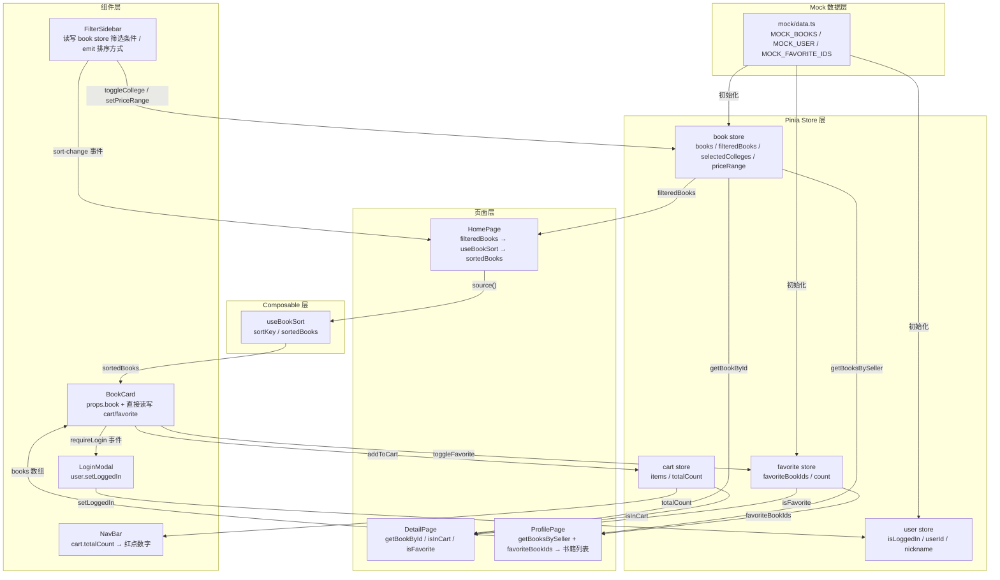

# 状态层架构文档

## 一、Store 边界划分

四个 Store 各管一块，互不引用、互不依赖：

| Store | 管什么 | 不管什么 |
|-------|--------|----------|
| **user** | 当前登录态、用户 ID/昵称/头像 | 不管谁的购物车、不管收藏列表 |
| **book** | 全量书籍数据、筛选条件、筛选结果 | 不管排序（排序在 composable）、不管购物车/收藏 |
| **cart** | 购物车条目、商品数量汇总 | 不管书籍详情、不管谁加的、不管收藏 |
| **favorite** | 收藏的书籍 ID 列表 | 不管书籍详情、不管购物车、不管筛选 |

核心原则：**每个 Store 只对自己的 ref/computed 有写权限**。跨 Store 的数据关联全部在组件层通过 computed 拼接完成，Store 之间零 import。

---

## 二、数据流总览



---

## 三、BookCard 复用机制

BookCard 是纯受控组件——**通过 props 接收书籍数据，自己不获取列表**。

```
┌─────────────────────────────────────────────────┐
│  BookCard                                        │
│                                                  │
│  props.book    ← 父组件传入完整 Book 对象          │
│  props.showFavorite  ← 控制收藏按钮是否显示        │
│                                                  │
│  内部直接访问 store：                              │
│  · favoriteStore.isFavorite(book.id)  → 红心样式  │
│  · cartStore.isInCart(book.id)        → 购物车样式 │
│  · cartStore.addToCart(book.id)       → 加购动作   │
│  · favoriteStore.toggleFavorite(id)   → 收藏动作   │
│  · userStore.isLoggedIn              → 登录检查   │
│                                                  │
│  emit:                                           │
│  · requireLogin  → 未登录收藏时通知父组件弹窗      │
└─────────────────────────────────────────────────┘
```

### 首页使用场景

```
bookStore.filteredBooks  →  useBookSort 排序  →  sortedBooks
                                                    ↓
                        HomePage 遍历 sortedBooks，逐个 <BookCard :book="book" />
```

数据来源：book store 的 `filteredBooks`（经学院 + 价格筛选后），再经 composable 排序。

### 个人中心"我收藏的"使用场景

```
favoriteStore.favoriteBookIds  →  [2, 5, 11, 14]
                                      ↓
bookStore.books.filter(b => ids.includes(b.id))  →  [Book, Book, ...]
                                                      ↓
                    ProfilePage 遍历，逐个 <BookCard :book="book" />
```

数据来源：favorite store 出 ID 列表 → book store 反查完整对象。两个 store 各出各的，组件层拼。

### 个人中心"我发布的"使用场景

```
userStore.userId (= 10086)  →  bookStore.getBooksBySeller(10086)  →  [Book, ...]
                                                                      ↓
                        ProfilePage 遍历，逐个 <BookCard :book="book" />
```

数据来源：user store 出 userId → book store 按 sellerId 过滤。

**关键点**：BookCard 不管数据从哪来——它只认 `props.book` 是个完整 Book 对象就行。列表怎么凑出来是父组件的事。

---

## 四、购物车红点实时同步原理

整条链路零事件、零 watch，纯靠 Vue 响应式 computed 传导：

```
① 用户点击 BookCard 上的购物车按钮
      ↓
② cartStore.addToCart(bookId)
   → items.ref push 新条目 / existing.quantity++
      ↓
③ cartStore.totalCount (computed)
   → items.value.reduce((sum, i) => sum + i.quantity, 0)
   → 因为 items 变了，computed 自动重算
      ↓
④ NavBar 组件里：
   const cartCount = computed(() => cartStore.totalCount)
   → 读的是同一个 Pinia store 的 computed
   → totalCount 一变，cartCount 立即跟着变
      ↓
⑤ 模板里 <span v-if="cartCount > 0">{{ cartCount }}</span>
   → cartCount 变了 → 依赖它的 DOM 自动更新
   → 外层 <Transition name="fade"> 处理数字出现/消失的淡入淡出
```

为什么不需要事件总线 / Vuex subscribe / 任何手动通知？

- Pinia store 的 computed 是全局共享的**同一个响应式引用**
- NavBar 和 BookCard 都调用 `useCartStore()` 拿到的是同一个 store 实例
- BookCard 写 `items` → `totalCount` 重算 → NavBar 读 `totalCount` 的 computed 重算 → 模板更新，整条链路由 Vue 的依赖追踪自动完成

一句话总结：**写端改 ref → computed 自动重算 → 读端 computed 自动重算 → DOM 自动更新**，三层 computed 传导，中间不需要任何胶水代码。

---

## 五、Store 之间的数据拼接模式

当某个功能需要跨 Store 数据时，**在组件层用 computed 拼，Store 之间不互相 import**：

| 功能 | 涉及 Store | 拼接位置 | 拼接方式 |
|------|-----------|----------|----------|
| 我收藏的书 | favorite + book | ProfilePage | `books.filter(b => favoriteIds.includes(b.id))` |
| 我发布的书 | user + book | ProfilePage | `getBooksBySeller(userId)` |
| 收藏按钮状态 | favorite + user | BookCard | `isFavorite(id)` + `isLoggedIn` 判断 |
| 首页筛选+排序 | book + composable | HomePage | `filteredBooks` → `useBookSort()` |

这种"Store 扁平化 + 组件层拼接"的模式好处：
- Store 保持无副作用、可独立测试
- 拼接逻辑跟页面强绑定，换个页面拼法可以完全不同
- 删页面不丢 Store，删 Store 马上知道哪些页面要改
